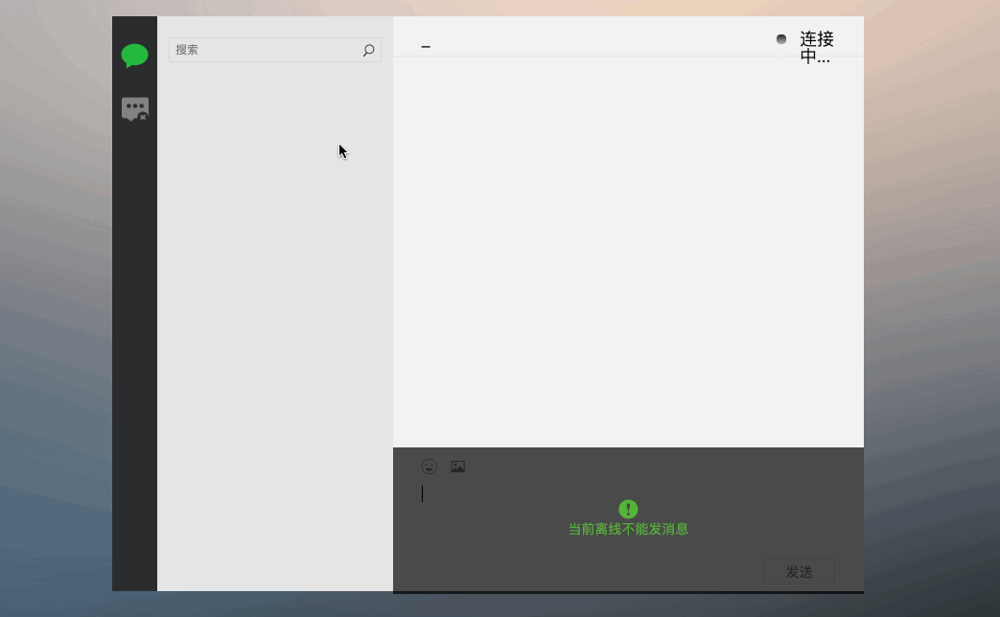

# 基于 Vue + ElementUI 的微信客服前端项目

本项目主要为接入微信公众号，让客服与客户通过公众号直接对话而开发并开源的

# 效果图

# 项目亮点

1. 界面高仿微信网页版
2. 支持发送文本（**包含部分表情**）和图片类消息
3. 支持接收微信支持的**所有格式的消息类型**和聊天有关的事件（如关注、取关、点击菜单等）
4. 开发环境下使用 Mockjs，**可完全脱离后端完成所有功能的交互体验**

# 技术栈

- Vue 框架
- Vuex
- Vue-router
- ElementUI
- Stompjs
- Sockjs
- Mockjs

# 代码规范

1. 命名规则
   1. .vue 文件 **大写驼峰**
   2. .js 文件 **小写横杠**
2. 异步请求
   1. 所有与后端交互的 api 都放在 `src/api` 目录中，
   2. 所有 url 放于 `api-path.js` 文件，并做好分类
   3. 每一类型的 api 有单独的 js 文件，每一个 url 对应一个方法，用于**封装**发送请求并处理结果的逻辑
   4. 需要发送请求的地方**直接调用 api 的方法获取结果**
3. Mock
   1. mock 相关的文件全部放在 `mock` 目录下
   2. 每个 xxx-api.js 文件对应一个 `xxx-api-mock.js`
   3. **每个请求都要有相应的 Mock 拦截并返回数据**
4. 与**业务无关的通用组件**才能放在 common 目录下

## 启动

1. 首次运行先执行 `npm install`
2. npm run dev
3. 浏览器打开 http://127.0.0.1:8080

# 参考

本项目样式及表情部分功能基于 [Vue-chat](https://github.com/han960619/Vue-chat) 项目改造而来，该项目仿微信页面做得非常细致。

# Buy me a coffee

    </img>
    </img>

